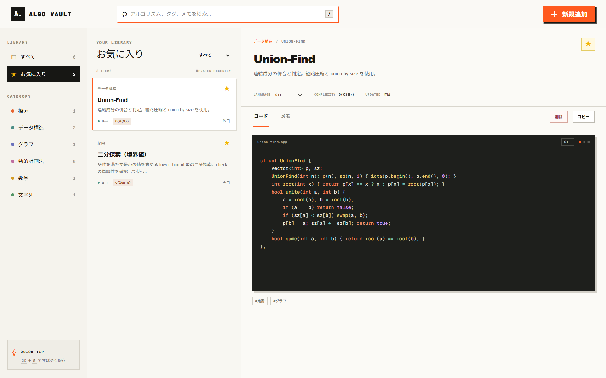
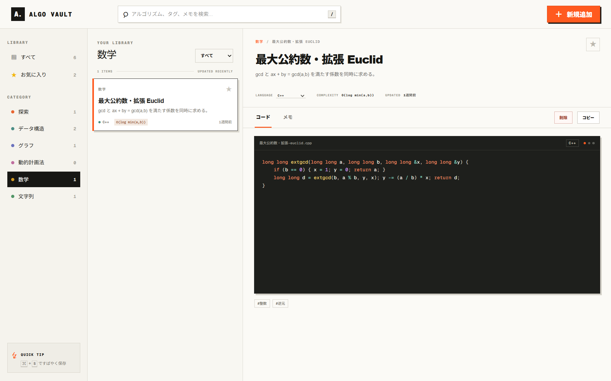
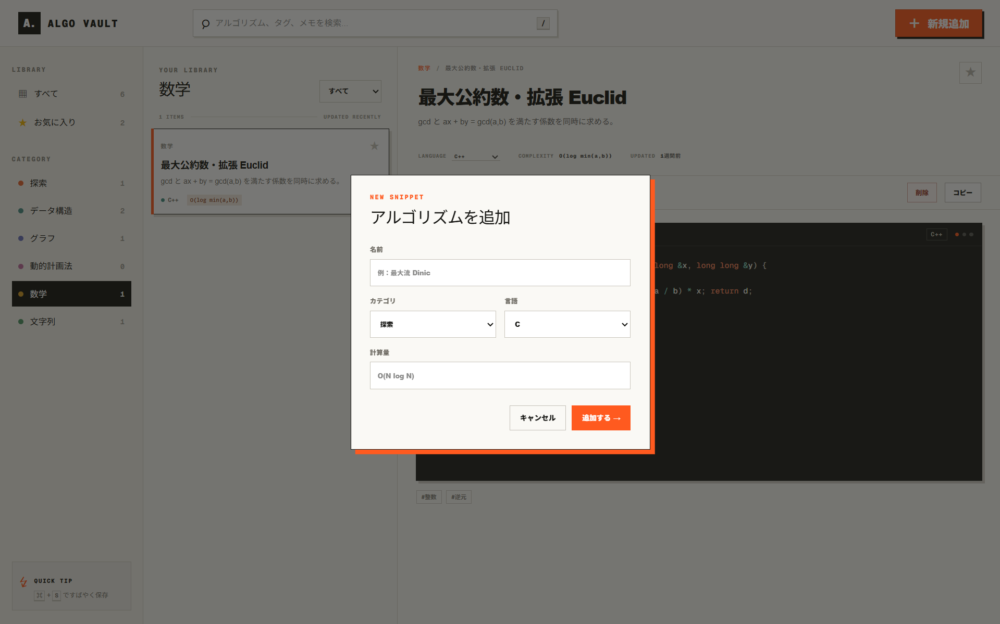
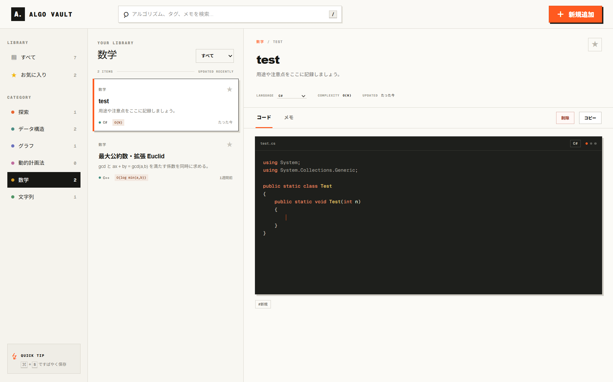

# Algo Vault

> アルゴリズムとコードスニペットを、検索・分類・編集できるクラウドノート。


競技プログラミングや技術学習で蓄積したアルゴリズムを、コード・計算量・メモ・タグと一緒に管理するWebアプリケーションです。検索から編集までを一画面で完結させ、変更内容はCloudflare D1へ自動保存します。

<p align="center">
  
</p>

## Features

- タイトル・説明・タグを横断するリアルタイム検索
- 探索、データ構造、グラフ、動的計画法、数学、文字列によるカテゴリ分類
- プログラミング言語とお気に入りによる絞り込み
- スニペットの追加・削除と、コード・タイトル・説明・タグ・言語・お気に入りの編集
- 500msのデバウンスを利用したCloudflare D1への自動保存
- Prism.jsによる15言語のシンタックスハイライト
- コードのワンクリックコピー
- `/` で検索、`Ctrl / Cmd + S` で保存できるキーボード操作
- デスクトップからモバイルまで対応するレスポンシブUI

### Supported languages

`C` `C++` `C#` `Java` `Python` `JavaScript` `TypeScript` `Go` `Rust` `Kotlin` `Swift` `Ruby` `Dart` `Scala` `Shell`

## Screenshots

### カテゴリ別ライブラリ

カテゴリごとの件数を確認しながら、目的のアルゴリズムだけに絞り込めます。選択したコードは右側のエディタですぐに閲覧・編集できます。

<p align="center">
  
</p>

### スニペットの新規登録

名前、カテゴリ、言語、計算量を入力して、新しいスニペットを追加できます。登録後はそのままコードとメモを編集できます。

<p align="center">
  
</p>

### 言語別シンタックスハイライト

選択した言語に応じて文法とファイル拡張子を切り替えます。C#を含む15言語に対応しています。

<p align="center">
  
</p>

## Architecture

```text
Browser
  └─ React UI / Code Editor
       └─ /api/algorithms (GET / POST / PUT / DELETE)
            └─ Cloudflare Worker
                 └─ Drizzle ORM
                      └─ Cloudflare D1
```

アプリケーションとAPIをCloudflare Workers上で実行し、静的アセットもWorkers Static Assetsから配信します。データはブラウザの`localStorage`ではなくD1に永続化されるため、再デプロイ後も保持されます。

## Tech Stack

| Area | Technology | Role |
| --- | --- | --- |
| Frontend | React 19 / TypeScript | UIと状態管理 |
| Framework | vinext | Next.js互換アプリのViteビルド |
| Runtime | Cloudflare Workers | SSRとAPIの実行環境 |
| Database | Cloudflare D1 | アルゴリズムデータの永続化 |
| ORM | Drizzle ORM / Drizzle Kit | 型安全なクエリとマイグレーション |
| Highlight | Prism.js | 言語別シンタックスハイライト |
| Tooling | Vite / ESLint / Wrangler | ビルド、品質管理、デプロイ |

## Design highlights

- 一覧と詳細を同時に確認できる3ペイン構成により、画面遷移を減らしました。
- オフホワイト、ブラック、オレンジを基調に、コードエディタが主役になる視覚設計にしています。
- UIを先に更新してからD1へ保存することで、クラウド永続化と軽快な編集操作を両立しています。
- 初回アクセス時のみサンプルデータを投入する状態をD1側で管理し、全件削除後にデータが復活しない設計です。
- APIでは入力検証と404処理を行い、CRUD操作の失敗を画面上の同期ステータスへ反映します。

## Getting started

### Requirements

- Node.js 22.13以降
- Cloudflareアカウント
- Wranglerで作成したD1データベース

### Local development

```bash
npm install
npm run typegen
npm run db:migrate:local
npm run dev
```

ローカルD1のデータは`.wrangler/`以下に保存されます。テーブルが空で、かつ初期化前の場合のみサンプルデータが登録されます。

### Deploy to Cloudflare

`wrangler.jsonc`の`database_id`を利用するD1データベースのIDへ変更してから、以下を実行します。

```bash
npx wrangler login
npm run db:migrate:remote
npm run deploy
```

CIからデプロイする場合は、`CLOUDFLARE_API_TOKEN`と`CLOUDFLARE_ACCOUNT_ID`をシークレットとして設定してください。

## Commands

| Command | Description |
| --- | --- |
| `npm run dev` | Cloudflare Workersランタイムでローカル開発 |
| `npm run build` | 本番用ビルド |
| `npm test` | 本番ビルドと構成テスト |
| `npm run lint` | ESLintによる静的解析 |
| `npm run typegen` | Workersバインディングの型生成 |
| `npm run db:generate` | D1マイグレーションの生成 |
| `npm run db:migrate:local` | ローカルD1へマイグレーションを適用 |
| `npm run db:migrate:remote` | リモートD1へマイグレーションを適用 |
| `npm run deploy` | Cloudflare Workersへデプロイ |

## Project structure

```text
app/
├─ api/algorithms/route.ts  # D1 CRUD API
├─ code-editor.tsx          # シンタックスハイライト対応エディタ
├─ globals.css              # UI・レスポンシブスタイル
└─ page.tsx                 # ライブラリ画面
db/
├─ schema.ts                # D1テーブル定義
└─ seed.ts                  # 初回サンプルデータ
drizzle/                    # D1マイグレーション
public/Images/              # README用スクリーンショット
wrangler.jsonc              # Workers・D1設定
```

## Future improvements

- Cloudflare Accessなどを利用したユーザー認証
- タグのサジェストと複数条件検索
- スニペットのインポート／エクスポート
- 更新履歴とバージョン管理

---

Built as a portfolio project with React, TypeScript, and Cloudflare.
